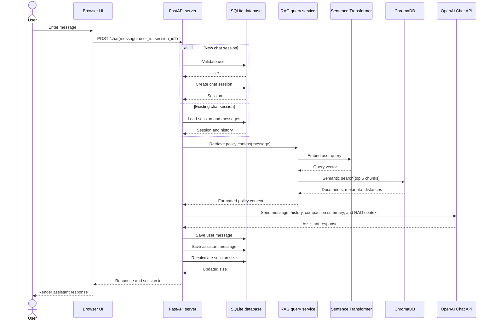
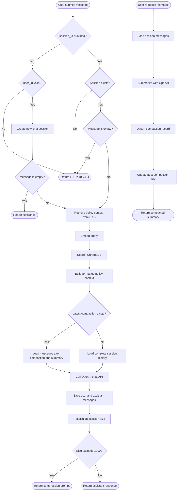
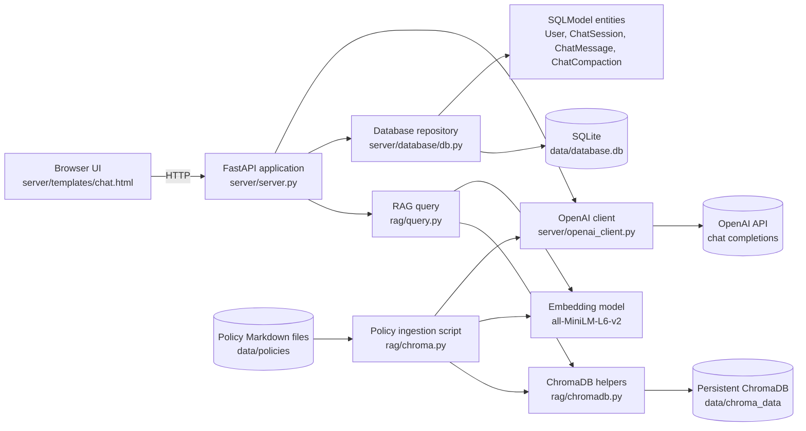

# Architecture Diagrams

These diagrams describe the current application flow and component boundaries.

## Chat Request Sequence

## Chat Request Flow

## Component Diagram

The `/compact` endpoint uses the same OpenAI client and database repository but does not perform a RAG search. Policy ingestion is a separate preparation step that chunks documents with OpenAI, embeds them locally, and stores the vectors in ChromaDB.