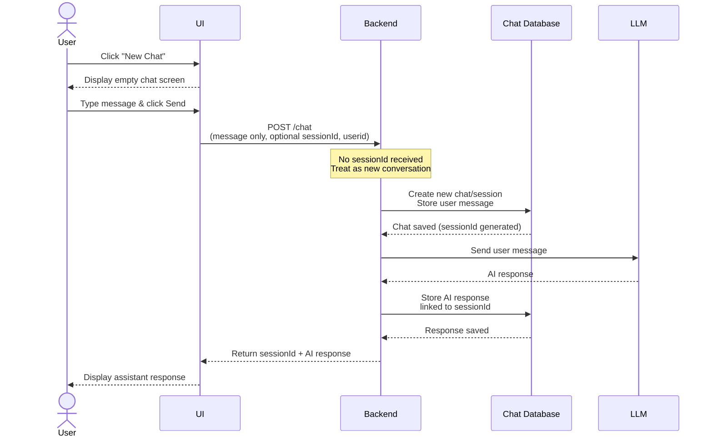
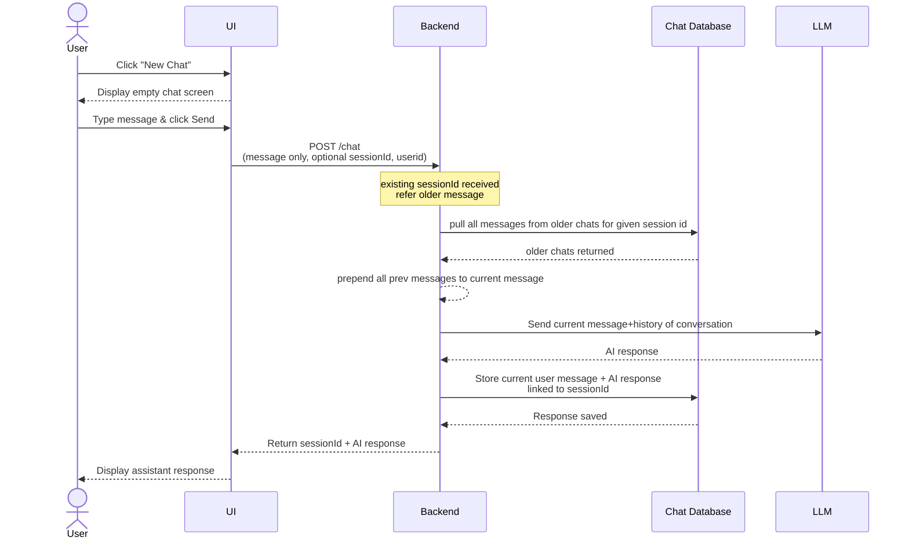

## assignment date : 25th July
1. my chat application retain hiostoiry of conversations
2. all chat sessions should be available to read on leftsidebar even if I restart the application
3. When I go back to any chat history and start chatting it should retain the contextr and responses from model should be based on that
4. Task; come up with HLD and LLD
        HLD : high level application diagram
        LLD : db design , api design changes, how db will integrate in api

## python topics
1. Classes
2. Modules
3. List
4. Dict
5. Iterations over dict and lists
6. Rest api all methods - GET put, POST
7. how to call other modules
6. SQL queries

DB Design

1. chat_sessions
        id - UUID
        title
        created_at
        last_modified_at
        user_id
2. User
        id - UUID
        name
        email
3. Chat messages
        id - UUID
        text
        timestamp
        session_id
        user_id
        role [user,assistant]

1. User visits the platform
        if there is already sessions user can start chating into existing session
        else
        user click on new chat button
                1. UI will start new chat and asks user to type message
                2. when user click on send, message will be set to backend without any session id
                3. backend will assume no session id means creation of new message
                4. backend will store this message into chat table
                5. backend will make api call to llm
                6. LLM will respond, backend will store this respnse message also into chat table
                7. backend respond back to ui with response

When new session started

When existing session used

## 1st AUG
### Agenda:
1. session management harness
2. scaling the sessions
3. moving away from direct api to Open AI sdk
4. Understanding system prompt and role based prompt

=====================================================
1. Finish compaction api and recompaction
2. Try to pass compacted message to openai message
3. convert open ai api to Openai sdk
