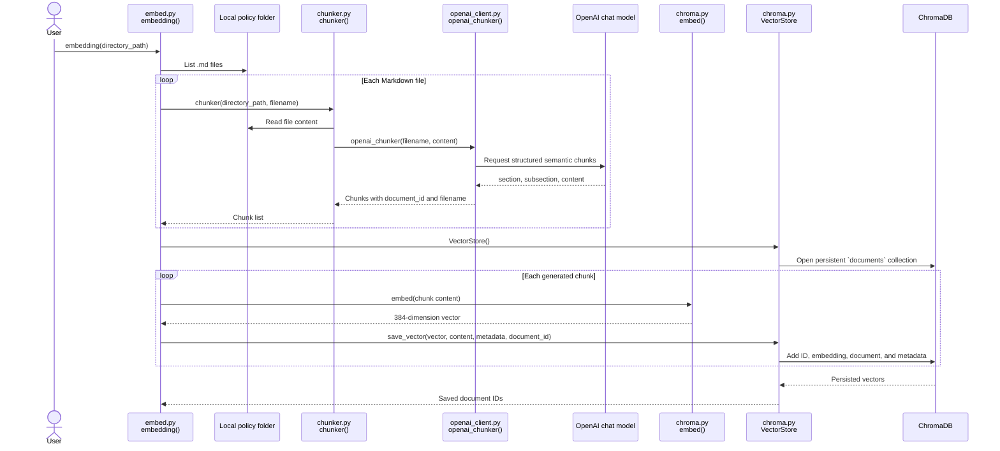

# Embedding Processing Diagrams

This document describes the current processing flow across `server/embed.py`,
`server/chunker.py`, and `server/database/chroma.py`.

## Sequence diagram



## Component diagram

```mermaid
flowchart LR
    Folder[Local policy folder\nMarkdown files] --> Embed

    subgraph Ingestion[Ingestion pipeline]
        Embed[embed.py\nembedding()] --> Chunker[chunker.py\nchunker()]
        Chunker --> OpenAIClient[openai_client.py\nopenai_chunker()]
        OpenAIClient --> LLM[OpenAI chat model]
        LLM -->|structured chunks| OpenAIClient
        OpenAIClient -->|document_id, filename, section, subsection, content| Chunker
        Chunker -->|chunks| Embed
        Embed --> Encoder[chroma.py\nembed()]
        Encoder -->|384-dimension embedding| Store[chroma.py\nVectorStore.save_vector()]
    end

    Store --> Chroma[(ChromaDB\ndocuments collection)]

    subgraph Retrieval[Query path]
        Query[Search text] --> Encoder
        Encoder -->|query vector| Search[chroma.py\nVectorStore.search_vector()]
        Search --> Chroma
        Chroma -->|IDs, chunk text, metadata, distances| Search
        Search --> Results[Ranked search results]
    end
```

## Stored record fields

For every saved chunk, Chroma receives:

| Field | Source |
| --- | --- |
| `id` | `chunk["document_id"]` |
| `embedding` | `embed(chunk["content"])` |
| `document` | `chunk["content"]` |
| metadata `title` | `chunk["filename"]` |
| metadata `section` | `chunk["section"]` |

`openai_chunker()` also creates a `subsection`, but the current `embed.py`
implementation does not include it in the metadata passed to `save_vector()`.

> Current behavior: `chunks` is reassigned for each file in `embedding()`, so
> after the file loop only the chunks from the final Markdown file are saved.
